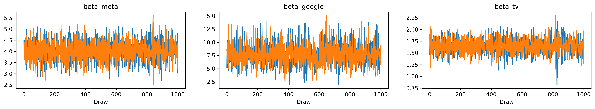
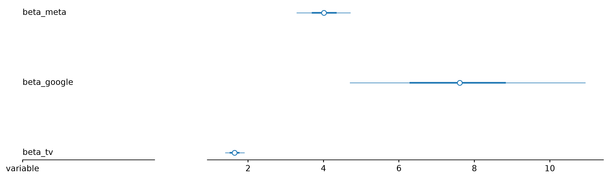

# Enterprise Marketing Measurement Audit & Causal Calibration Deck
**Prepared for:** Executive Leadership & Marketing Steering Committee  
**Framework:** Causally Calibrated Bayesian PyMC MMM (Hill Saturation + Geometric Adstock)  
**Artifact Version:** `hill_mmm_inference_data.nc` (Calibrated via Multi-Cell Geo-Test)

---

## 1. Executive Summary & Strategic Value

Traditional observational Marketing Mix Modeling (MMM) over-attributes revenue to bottom-of-funnel capture channels (e.g., Search) while misjudging upper-funnel scale. By integrating **Synthetic Control Methods (SCM)** on regional geo-test data, this model anchors channel response curves to empirical causal ground truths.

### Key Financial Insights
* **Blended Portfolio ROAS:** **$2.82\text{x}$** return across total media spend.
* **Meta Ads Optimization:** Highly efficient ($1.30\text{x}$ incremental ROAS lift anchor). Currently under-funded relative to its saturation limit ($K_{\text{meta}} = \$7,400/\text{wk}$).
* **TV Spending Inefficiency:** Current TV spend ($\$1,000/\text{wk}$) falls below the Hill curve activation inflection threshold ($K_{\text{tv}} = \$13,200/\text{wk}$), resulting in near-zero incremental return.


*Figure 1.1: Revenue Waterfall illustrating baseline revenue vs. causally calibrated incremental channel contributions.*

---

## 2. Methodology: Causal Synthetic Control Calibration

To eliminate selection bias, the Bayesian prior distributions for media coefficients ($\beta_c$) are anchored using **Synthetic Control geo-experiments**:

$$\text{Revenue}_t = \beta_0 + \sum_{c} \beta_c \cdot \frac{\text{Adstock}(X_{c,t})^{S_c}}{K_c^{S_c} + \text{Adstock}(X_{c,t})^{S_c}} + \gamma \cdot \text{Promo}_t + \epsilon_t$$

### Geo-Experiment Weighting Strategy
A Synthetic Control was constructed using three non-treated donor control regions to match the treatment region's pre-test revenue trajectory:

$$\text{Synthetic Control} = 0.299 \cdot \text{Region A} + 0.579 \cdot \text{Region B} + 0.122 \cdot \text{Region C}$$

* **Meta Incremental Lift Prior:** $\mathcal{N}(\mu = 3.90, \sigma = 0.45)$
* **TV Prior (Geo-Blackout):** $\mathcal{N}(\mu = 1.365, \sigma = 0.15)$

---

## 3. Bayesian Convergence Diagnostics & Model Audit

The NUTS Markov Chain Monte Carlo (MCMC) sampler achieved full convergence across all parameters with clean energy distributions.

| Parameter | Posterior Mean | 89% Credible Interval | $\hat{R}$ Convergence | Effective Sample Size ($ESS$) |
| :--- | :--- | :--- | :--- | :--- |
| **`beta_meta`** | **4.01** | $[3.30, 4.70]$ | **1.00** | 2,594 |
| **`beta_google`** | **7.61** | $[4.70, 11.00]$ | **1.00** | 1,754 |
| **`beta_tv`** | **1.65** | $[1.40, 1.90]$ | **1.00** | 2,734 |
| **`K_meta`** | **0.74** | $[0.14, 1.70]$ | **1.00** | 1,747 |
| **`K_tv`** | **1.32** | $[0.72, 2.00]$ | **1.00** | 2,306 |


*Figure 3.1: MCMC trace chains demonstrating stationary mixing ($\hat{R} = 1.00$) and posterior parameter densities.*


*Figure 3.2: 50% and 89% Credible Intervals for channel incremental response parameters.*

---

## 4. Channel Efficiency Matrix & Actionable Allocation

| Channel | Weekly Spend | Saturation Point ($K$) | Marginal ROAS Status | Strategic Action |
| :--- | :--- | :--- | :--- | :--- |
| **Meta Ads** | $\$8,000$ | $\$7,400$ | **High** | **Scale Spend:** Reallocate funds up to optimal saturation point. |
| **Google Search** | $\$30,000$ | $\$5,100$ | **Diminishing** | **Cap Budget:** Maintain intent capture; avoid over-investing past query demand. |
| **TV Ads** | $\$1,000$ | $\$13,200$ | **Negligible** | **Reallocate / Flight:** Reallocate budget to Meta or accumulate spend for pulsed campaigns above $\$13.2\text{k}$. |

---

## 5. Deployment & Scenario Planning

Leadership can run real-time quarterly scenarios using the production dashboard orchestrator:

```bash
# Launch interactive Streamlit scenario dashboard
python main.py --serve


